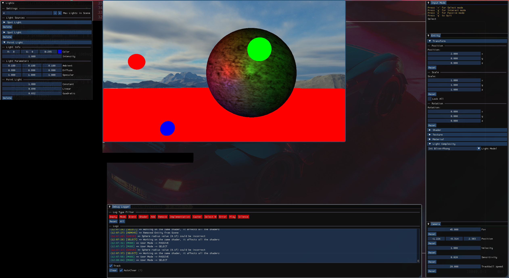

# Computer Graphics Second Assignment 

## Description

In this project you can create a scene using Cubes, Spheres or obj files; including lights, textures and materials.

## Launch

All external libraries should be already integrated in the project, but you need to install `glm`, `assimp`, `freetype2` in your machine or you can install them using NuGet package manager inside Visual Studio.

### Windows

To compile this application you can open in Visual Studio 2022 using C++ 17.

```
install-package glm
install-package assimp
install-package freetype2
```

After the installation you can compile and run the application.

If you are getting some errors they should be fixed by including again all the custom directories starting with a capital letter: like "Application" or "Menu".
This error could be caused because the Visual Studio solution could not be updated with some newer files.

### Linux

If you have installed the package `premake5` you can use the following lines:

```bash
premake5 gmake ; make -j 6
```

In this way you should be able to run the application in the directory `bin/Debug`.

If you are using a window manager you should enable floating for windows with title `Lost In Space` and class `ImGuiWindow`.

#### i3 config example

```
for_window [title="Lost In Space"] floating enable
for_window [class="ImGuiWindow"] floating enable
```

## Important
If you want to add a Texture or an Object in the scene, the corresponding file should be in the `resource/textures` or `resources/models`.

Working on fixing this issue.

## Use

The firs time you run this application you must organize all ImGui windows opened in your screen, automatically their state will be saved in a file called `imgui.ini`.

You can press `v`, `g` or `p` to change mouse mode:
 - `v` => Select mode where you can select every object or light caster and interact with the Entity panel.
 - `g` => Interact mode, in case you have your panel in the viewport window you should go in this mode to disable selecting action
 - `p` => Passive mode, in this mode you can move freely in the scene using `wasd` and the mouse to move your camera, you can modify in the Camera panel all the settings you want like `Camera::velocity` or `Camera::sensitivity` etc.

If you press the `Right Mouse Button` a popup will appear with a sub menu where you can choose which entities you want to add to the scene.
They will have a default Position, Color and Material; you can change texture too in the Entity panel if the object is selected.

Also you can choose to import an `obj` file into the scene by clicking Add -> Object; it will use the `mtl` file to defines the materials for each `Mesh`. In this case another ImGui window should be resized only the first time and positioned where you want (same thing for `Change Texture` button.

You can add 3 types of light:
 - Directional
 - Point
 - Spot

The lights you add to the scene will appear in the viewport like a white sphere but you can select and move around the scene where you want (texture and rotation will not affect light casters).
In the `Light` panel you can see all the lights in the scene and modify their parameters: color, intensity, direction, etc.
All these data are sent to shaders in real-time.
If you click on the `Delete` button below each light you can delete the above light from the scene.

Also if you have selected an Entity or a Light caster in the scene you can remove it by pressing the `Del` key (`Canc`, on Italian keyboard).

 
